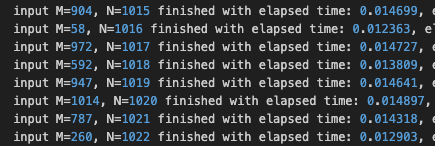

## CptS 223 PA2 - Josephus Game - Gavin Travis

### 1. Does machine processing power affect execution time?
Yes, the machine being used to run the code does impact execution time. While I did not test the code across multiple machines, I do understand that differences between machines such as clock rate directly impact the execution time by changing the number of instructions ran each second. Since the data set used in the program is not very large I would not expect large differences in time, but running the program across several machines should result in slightly different execution times.

### 2. Which performs better: std::list or std::vector? Under what conditions?
On average std::vector performed better than std::list for the josephus problem. Std::vector recorded an average simulation time of 0.003575 seconds while std::list recorded 0.00527 seconds. Up to an N of 30, std::list was running in about half of the time of std::vector, but as the size of the data grew std::vector did not show any increase in execution time. Interestingly, the jump from N of 30 to N of 31 saw std::vector actually reduce run time from 0.009625 seconds to 0.002073 seconds where the execution time roughly stayed for the rest of the program run. In comparison, std::list continued to steadily climb in execution time as N grew. This trend continued as N increased to the maximum size of 1025 where std::vector is completing the simulation about 7 times as fast as std::list.

### 3. How does N impact runtime compared to M?
As variables N and M changed the vector and list collections responded differently to the changes. As mentioned earlier, std::list grew in execution time roughly linearly as N grew. Reviewing the data it appears that the larger the M value the slower the simulation when compared to runs with similar size N. See the log screenshot below:

For similar size data sets, when M is smaller the elapsed time to solve is less. This makes sense as the list will have to do less traversal to find the next element to remove.

std::vector did not appear to be as clearly affected by varying N and M values as std::list. Over time as N grew the vector completed the simulation in roughly the same time. Since data in vectors can accessed directly by index this outcome is expected. While std::list requires stepping one by one through the collection to find the next element, std::vector is able to get direct access to the next element to be removed with constant time. As the collection grows in size, this advantage becomes more and more valuable!